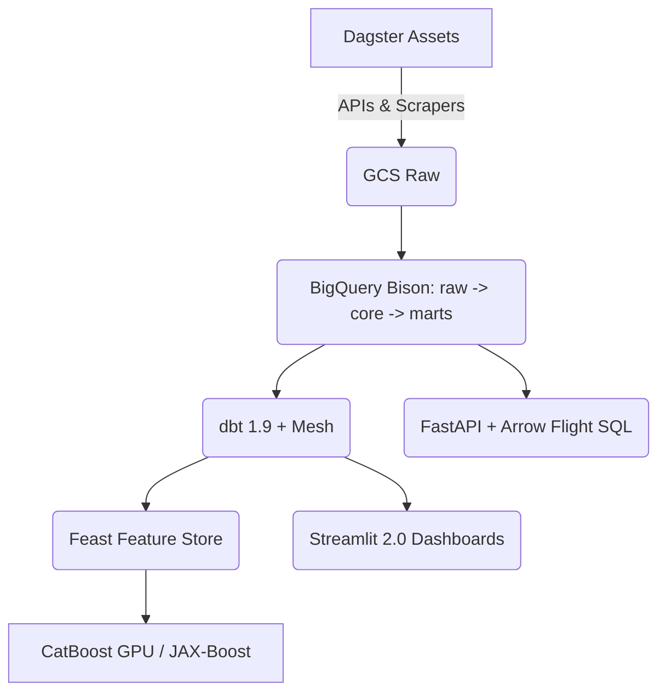

# NBA Insight Engine

> Build a reusable pipeline that ingests multi‑modal NBA data, transforms it in BigQuery, and serves advanced models & dashboards that explain storylines (e.g., Pacers’ Game 7 push) and project future performance (e.g., Timberwolves 2025 season outlook).


- [Core Questions](#core-questions)
- [Objectives](#objectives)
- [Architecture](#architecture)
- [Data Sources](#data-sources)
- [Tech Stack](#tech-stack)
- [Project Structure](#project-structure)
- [Setup](#setup)
- [Quickstart](#quickstart)
- [Roadmap](#roadmap)
- [Contributing](#contributing)
- [License](#license)


---


## Core Questions

1. **Player performance forecasting** – How many points, USG%, TS%, etc. will a player post next game?
2. **Team over/under‑performance** – Which clubs are beating—or falling short of—their underlying metrics and why?
3. **Narrative validation** – Are fatigue, lineup tweaks, or media sentiment driving momentum swings?
4. **Season simulations** – What are team win totals & playoff odds under Monte‑Carlo runs?

## Objectives

- 🏀 **Player Models** – CatBoost/JAX‑Boost next‑game projections.
- 🔮 **Team Sims** – ELO + Gradient‑Boost matchup engine.
- 📊 **Storyline Analytics** – Quantify fatigue, sentiment, clutch streaks.
- ⏱ **Flexible Scheduling** – Daily in‑season, weekly off‑season, on‑demand triggers.

## Architecture

<details>



</details>


### Pipeline Steps

1. **Ingest** – Dagster + Fugue parallel pulls from `nba_api`, ESPN Inactives, Second Spectrum, Twitter v2, GDELT.
2. **Stage** – Versioned Parquet in GCS; DuckDB Cloud Cache for local dev.
3. **Warehouse** – Partitioned/clustered BigQuery (Bison release).
4. **Transform** – dbt tests, docs, macros; feature marts.
5. **Feature Store** – Feast on BigQuery.
6. **Model** – MLflow 3.0 experiments; scheduled retrain.
7. **Serve** – Streamlit 2.0 dashboards + REST/gRPC endpoints.
8. **CI/CD** – GitHub Actions, Dagster Deployments, dbt Cloud jobs.

## Data Sources

| Domain             | Example Fields              | Primary Source           |
| ------------------ | --------------------------- | ------------------------ |
| Box/Play‑by‑play   | points, fouls, possessions  | `nba_api` bulk endpoints |
| Advanced Metrics   | ORTG, TS%, PACE             | Basketball‑Reference     |
| Injuries & Lineups | player status, DNPs         | ESPN scraper             |
| Player Tracking    | shot distance, speed        | Second Spectrum          |
| Social Sentiment   | tweets per player, polarity | Twitter API v2           |
| News Tone          | headline sentiment          | GDELT RSS                |

## Tech Stack

| Layer               | Tooling                                           |
| ------------------- | ------------------------------------------------- |
| Language            | Python 3.11 (pandas, **polars**, RAPIDS cuDF)     |
| Ingestion           | Dagster 1.6, Fugue, Ray                           |
| Storage             | GCS, BigQuery **Bison**                           |
| Transform           | dbt 1.9 + Mesh                                    |
| Feature Store       | Feast                                             |
| Modeling            | CatBoost GPU, LightGBM v5, **JAX‑Boost**, Prophet |
| Experiment Tracking | MLflow 3.0                                        |
| Visualization       | Streamlit 2.0, Looker Studio                      |
| Orchestration       | Dagster Deployments                               |
| CI/CD               | GitHub Actions, dbt Cloud                         |

## Project Structure

```text
nba-pipeline/
├── .github/workflows/        # CI pipelines
├── dagster/                  # Dagster asset definitions
├── dbt/                      # dbt project (sources, models, tests)
├── notebooks/                # EDA & storyline notebooks
├── src/
│   ├── ingestion/            # API clients & scrapers
│   ├── features/             # Feature engineering code
│   └── models/               # Training & inference
├── streamlit_app/            # Dashboard code
└── README.md
```

## Setup

```bash
# 0.  make sure bzip2 is present (usually is)
sudo apt-get update -y && sudo apt-get install -y bzip2

# 1.  fetch + unpack straight into /usr/local/bin
curl -Ls https://micro.mamba.pm/api/micromamba/linux-64/latest \
| sudo tar -xvjf - -C /usr/local/bin --strip-components=1 bin/micromamba

# 2.  verify
micromamba --version

# 3.  create & activate the env
micromamba create -y -n nba-engine -f env.yml
# eval "$(micromamba shell hook --shell bash)" # add micromamba hook to this shell only
micromamba activate nba-engine
```

## Quickstart

```bash
# Run Dagster locally
pip install -e . 
pkill -f dagster || true   # stop old server
dagster dev -w workspace.yaml

# Backfill 2023‑24 game logs
python src/ingestion/backfill_games.py --season 2024

# Build dbt models
dbt build --select tag:core
```

## Roadmap

| Phase | Target Date | Milestone                                   |
| ----- | ----------- | ------------------------------------------- |
| P0    | **Day 3**   | Repo scaffold + raw games in BigQuery       |
| P1    | **Week 2**  | dbt staging & marts for boxscore + injuries |
| P2    | **Week 4**  | MVP CatBoost player model (RMSE benchmark)  |
| P3    | **Month 2** | Team simulation & sentiment integration     |
| P4    | **Month 3** | Streamlit dashboards + automated scheduling |


- Week 0 – Stand up GCP project, BQ datasets, and Composer; commit repo skeleton.
- Week 1 – Ingest/backfill game logs 2014-2025; populate dim_*, fct_boxscore.
- Week 2 – Build dbt models for rolling player stats + team ELO; validate with Looker.
- Week 3 – Baseline CatBoost model: predict next-game points (features = last-10 rolling stats, minutes, opponent DRTG, rest days).
- Week 4 – Case study: Pacers-OKC series. Join fatigue (games in 14 days), social sentiment, and Net Rating trend; write blog-style notebook.


--------------------------------------


export SCRAPERAPI_KEY="xxxxxxx"
echo 'export GOOGLE_APPLICATION_CREDENTIALS=/workspaces/.gcp/key.json' >> ~/.bashrc


--------------------------------------


curl -i \
  -H "User-Agent: Mozilla/5.0 (Windows NT 10.0; Win64; x64) AppleWebKit/537.36 (KHTML, like Gecko) Chrome/125.0.0.0 Safari/537.36" \
  -H "Referer: https://stats.nba.com" \
  -H "Origin: https://www.nba.com" \
  -H "x-nba-stats-token: true" \
  -H "x-nba-stats-origin: stats" \
  "https://api.scraperapi.com?api_key=$KEY&premium=true&keep_headers=true&country_code=eu&retry=3&timeout=90000&url=https%3A%2F%2Fstats.nba.com%2Fstats%2Fleaguegamelog%3FCounter%3D0%26Direction%3DASC%26LeagueID%3D00%26PlayerOrTeam%3DT%26Season%3D2024-25%26SeasonType%3DRegular%2BSeason%26Sorter%3DDATE"


python - <<'PY'
from nba_engine.patch_http import nba_get
rows = nba_get(
    "leaguegamelog",
    {
        "Counter": 0, "Direction": "ASC",
        "LeagueID": "00", "PlayerOrTeam": "T",
        "Season": "2024-25", "SeasonType": "Regular Season",
        "Sorter": "DATE",
    },
)["resultSets"][0]["rowSet"]
print("leaguegamelog rows →", len(rows))
PY


python - <<'PY'
from nba_engine.assets.leaguegamelog_2025 import leaguegamelog_2025
print("rows:", leaguegamelog_2025().metadata["rows"])
PY


## Contributing

PRs welcome! See `CONTRIBUTING.md` for guidelines & DCO.

## License

MIT © 2025 Hannah L.

---


